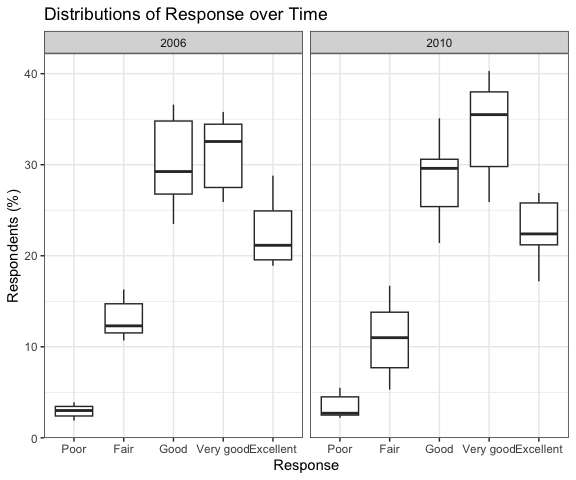

P8105: Homework 3
================
Derek Lamb
2023-10-10

I will load all necessary packages here. I also am including the code
that Dr. Goldsmith showed in class, to set figure color and size
preferences. I have modified it slightly: I prefer `theme_bw()` over
`theme_minimal()` and I may change the color scheme from the default
`viridis`.

``` r
library(tidyverse)
library(knitr)

opts_chunk$set(
  fig.width = 6,
  out.width = "90%"
)

## These are options that i'm going to treat as default for now
## I don't love viridis, but don't have a better option yet
theme_set(theme_bw() + theme(legend.position = "bottom"))

options(
  ggplot2.continuous.colour = "viridis",
  ggplot2.continuous.fill = "viridis"
)

scale_colour_discrete = scale_colour_viridis_d
scale_fill_discrete = scale_fill_viridis_d
```

# Problem 1

``` r
# Load data from the provided package
library(p8105.datasets)
data("instacart")
```

### Data set size, user behavior

This data set is massive, containing 1384617 observations of 15
variables. Each row is a specific item from an order, in total 131209
orders are included from 131209 unique users. There appear to be no
repeat orders from users in this data set, although 828824 items are
items that were previously ordered by that user. This accounts for 60%
of the orders, showing that only a small portion of instacart activity
is captured by this data set. There are no first-time orders in this
data set; this is on average order number 17 for users (median order
number 11 ). On average, users placed their orders 17.1 days after their
previous one.

### Aisles & products

There are 134 unique aisles included in the data set. In the following
code chunk, I’ll find the most ordered from aisles.

``` r
instacart |> 
  group_by(aisle) |> 
  summarize(n_obs = n()) |> 
  arrange(desc(n_obs)) |> 
  head() |> 
  kable(col.names = c("Aisle", "Number of Orders"))
```

| Aisle                         | Number of Orders |
|:------------------------------|-----------------:|
| fresh vegetables              |           150609 |
| fresh fruits                  |           150473 |
| packaged vegetables fruits    |            78493 |
| yogurt                        |            55240 |
| packaged cheese               |            41699 |
| water seltzer sparkling water |            36617 |

The two most ordered from aisles are fresh vegetables and fresh fruits,
with about 150,000 orders each. Below, you can see a plot of all aisles
with more than 10,000 orders.

``` r
instacart |> 
  group_by(aisle) |> 
  summarize(n_obs = n()) |> 
  filter(n_obs >=10000) |> 
  ggplot(aes(y = reorder(aisle, n_obs), x = n_obs)) +
  geom_bar(alpha = .9, stat = "identity") + 
  labs(
    title = "Instacart aisles with more than 10,000 orders",
    x = "Number of orders",
    y = "Aisle"
  )
```


To look more closely at the data set, I created a table examining the
three most popular items from a set of aisles.

``` r
instacart |> 
  group_by(aisle, product_name) |> 
  filter(aisle == "baking ingredients" | aisle == "dog food care" | aisle == "packaged vegetables fruits") |> 
  summarize(n_obs = n()) |> 
  filter(min_rank(desc(n_obs)) <= 3) |> 
  mutate(
    rank = min_rank(desc(n_obs)),
    item = paste(product_name, " (", as.character(n_obs),")", sep = "")
         ) |> 
  select(-product_name, -n_obs) |> 
  pivot_wider(
    names_from = aisle,
    values_from = item
  ) |> 
  arrange(rank) |> 
  kable(col.names = c("Rank in Aisle", "Baking Ingredients", "Dog Food & Care", "Packaged Vegatables & Fruits"), caption = "Item (# of orders)")
```

| Rank in Aisle | Baking Ingredients      | Dog Food & Care                                    | Packaged Vegatables & Fruits |
|--------------:|:------------------------|:---------------------------------------------------|:-----------------------------|
|             1 | Light Brown Sugar (499) | Snack Sticks Chicken & Rice Recipe Dog Treats (30) | Organic Baby Spinach (9784)  |
|             2 | Pure Baking Soda (387)  | Organix Chicken & Brown Rice Recipe (28)           | Organic Raspberries (5546)   |
|             3 | Cane Sugar (336)        | Small Dog Biscuits (26)                            | Organic Blueberries (4966)   |

Item (# of orders)

### Apples & Ice Cream

``` r
instacart |> 
  filter(product_name == "Pink Lady Apples" | product_name == "Coffee Ice Cream") |> 
  group_by(product_name, order_dow) |> 
  summarize(avg_hour = mean(order_hour_of_day)) |> 
  pivot_wider(
    names_from = order_dow,
    values_from = avg_hour
  ) |> 
  kable(digits = 1, col.names = c("Product", "Sunday", "Monday", "Tuesday", "Wednesday", "Thursday", "Friday", "Saturday"))
```

    ## `summarise()` has grouped output by 'product_name'. You can override using the
    ## `.groups` argument.

| Product          | Sunday | Monday | Tuesday | Wednesday | Thursday | Friday | Saturday |
|:-----------------|-------:|-------:|--------:|----------:|---------:|-------:|---------:|
| Coffee Ice Cream |   13.8 |   14.3 |    15.4 |      15.3 |     15.2 |   12.3 |     13.8 |
| Pink Lady Apples |   13.4 |   11.4 |    11.7 |      14.2 |     11.6 |   12.8 |     11.9 |

While the majority of ordering appears concentrated in the midle of the
day, coffee ice cream is bought a bit later in the afternoon,
particularly during Weekdays.

# Problem 2

In the code chunk below, I will load the data for this problem, filter
`topic` to just Overall Health, and recode `response` as a factor
variable.

``` r
data("brfss_smart2010") 
df_brfss = brfss_smart2010|> 
  janitor::clean_names() |>
  filter(topic == "Overall Health")|> 
  mutate(response = factor(response, levels=c("Poor", "Fair", "Good", "Very good", "Excellent")))
```

### Number of sites

I will look at the number of sites per state.

``` r
df_brfss |> 
  filter(year == 2002) |> 
  group_by(locationabbr) |> 
  summarize(n_site = n_distinct(locationdesc)) |> 
  filter(n_site >= 7) |> 
  pull(locationabbr)
```

    ## [1] "CT" "FL" "MA" "NC" "NJ" "PA"

These 6 states have 7 or more locations sampled within them in 2002,
whereas there were 14 states that had 7 or more locations in 2010:

``` r
df_brfss |> 
  filter(year == 2010) |> 
  group_by(locationabbr) |> 
  summarize(n_site = n_distinct(locationdesc)) |> 
  filter(n_site >= 7) |> 
  pull(locationabbr)
```

    ##  [1] "CA" "CO" "FL" "MA" "MD" "NC" "NE" "NJ" "NY" "OH" "PA" "SC" "TX" "WA"

### Excellence over Time

In the plot below, I have graphed the percentage of excellent answers to
questions about Overall Health over time, from 2002 to 2010. The
response are separated by state, and represent an average across the
locations within the state. There appears to be a slight downward trend,
but it is not immediately apparent within the noise of the data.

``` r
df_brfss |> 
  filter(response == "Excellent") |> 
  group_by(year, locationabbr) |> 
  summarize(avg_excellent = mean(data_value)) |> 
  ggplot(aes(x = year, y = avg_excellent, group = locationabbr, color = locationabbr)) +
  geom_line() +
  labs(
    title = "Spaghetti Plot of BFRSS Excellent Scores over Time",
    x = "Year",
    y = "Excellent Health (%)"
  ) + 
  theme(legend.position = "none")
```


### NY State

For the following I filtered the data to only New York responses in 2006
and 2010. I then plotted the distribution of scores over the years,
coloring by County.

``` r
df_brfss |> 
  filter(locationabbr == "NY" & (year == 2006 | year == 2010)) |> 
  separate(locationdesc, into = c("state", "county"), "-") |> 
  select(year, county, response, data_value) |> 
  ggplot(aes(x = response,  y = data_value)) + 
  geom_boxplot() +
  geom_point(aes(color = county))+
  facet_grid(. ~ year)
```



# Problem 3

I will import `nhanes_covar.csv`, then `nhanes_accel.csv`, and then
combine the two after some preliminary tidying. In `nhanes_covar.csv`, I
changed variable names to snake case and recoded `sex` and `education`
to character variables. The `bmi` and `education` variables are missing
data for some subjects, but the missing data were appropriately labelled
as `NA` so I didn’t need to make any changes there.

The only modification I needed to make to `nhanes_accel.csv` was
changing the `seqn` indicator variable name to be lower case. I think
that R is handling the scientific notation of some columns correctly. If
this proves to be a problem, I will address it later.

``` r
# Import and tidy covariate info
df_subjects <- read_csv("data/nhanes_covar.csv", skip = 4) |> 
  janitor::clean_names() |> 
  mutate(
    sex = case_match(sex,
                     1 ~ "male",
                     2 ~ "female"
                     ),
    education = case_match(education,
                           1 ~ "incomplete_hs",
                           2 ~ "complete_hs",
                           3 ~ "post_hs"
                           )) 

# Import and tidy accelerometer info
df_accel <- read_csv("data/nhanes_accel.csv") |> 
  janitor::clean_names()
```

I have verified that the same 250 subjects are present in both data
sets. It therefore doesn’t matter which of the `._join()` functions I
use. I will now combine these two dataframes and then convert the
accelerometer data from a wide to a long format. The assignment also
specifies to exclude individuals younger than 21, or those with missing
demographic data, so I will do that now as well.

``` r
df_nhanes <- left_join(df_subjects, df_accel, by = join_by(seqn)) |> 
  pivot_longer(min1:min1440,
    names_to = "min",
    values_to = "acceleration",
    names_prefix = "min"
  ) |> 
  mutate(min = as.numeric(min)) |> 
  filter(age >= 21) |> 
  drop_na(education)
```

This final dataframe contains 332640 observations of 7 variables. It
records basic demographic information, such as `age`, `sex`, and
`education` along with `bmi` for 231 subjects of the NHANES study. It
then tracks a person’s movement using an accelerometer every minute over
the course of one day.

### Demographics

In order to better understand the participants in this study, I created
a basic table of participants by `sex` and `education` variables.

``` r
df_nhanes |> 
  group_by(sex, education) |> 
  summarize(n_subj = n_distinct(seqn)) |> 
  pivot_wider(
    names_from = sex,
    values_from = n_subj
  ) |> 
  mutate(
    total = female + male,
    education = case_match(
      education,
      "complete_hs" ~ "Complete High School",
      "incomplete_hs" ~ "Incomplete High School",
      "post_hs" ~ "Post High School"),
    education = fct_relevel(education, c("Incomplete High School", "Complete High School", "Post High School")),
  ) |> 
  arrange(education) |> 
  kable(col.names = c("Education", "Female", "Male", "Total"))
```

    ## `summarise()` has grouped output by 'sex'. You can override using the `.groups`
    ## argument.

| Education              | Female | Male | Total |
|:-----------------------|-------:|-----:|------:|
| Incomplete High School |     29 |   28 |    57 |
| Complete High School   |     23 |   36 |    59 |
| Post High School       |     59 |   56 |   115 |
